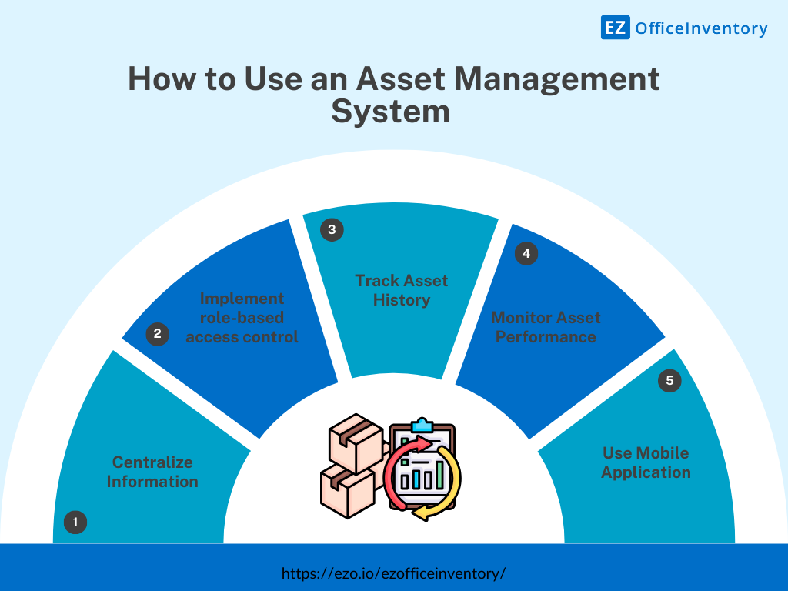
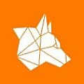
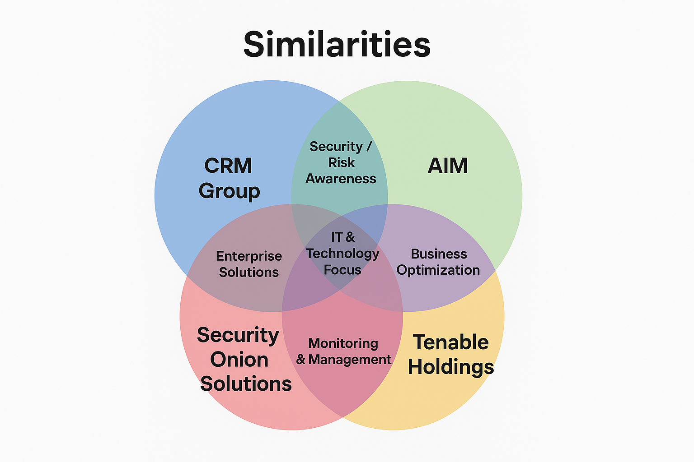
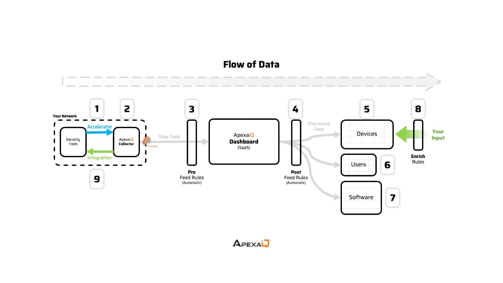

Weekly Research Report\
Yash Ramesh Fating \| Date : 22-sept-2025

# 1. What Does ApexaiQ Do ? What industry problems does it solves ?

Sol : Basically it will do tech assets Management\
Following are the types of tech Assets :

Hardware → laptops, desktops, servers, networking devices, IoT devices.

Software → applications, operating systems, licenses, SaaS tools.

Cloud resources → VMs, storage, subscriptions.

Digital assets → data, intellectual property, code repositories.

**Following are the problems which would be solved by ApexaiQ :**

**1.Lack of Visibility (Shadow IT)**

- Many organizations don't know all the devices, apps, and cloud
  services being used.

- ApexaiQ provides a **single source of truth** for assets.

2.**Cybersecurity Blind Spots**

- Outdated, unpatched, or unknown assets are prime entry points for
  hackers.

- ApexaiQ identifies vulnerabilities, misconfigurations, and weak
  points.

3.**Compliance Challenges**

- Regulations like HIPAA, ISO 27001, GDPR require strict IT asset
  control.

- ApexaiQ ensures assets are **compliant and auditable**.

4.**Obsolescence & Lifecycle Issues**

- Companies often run systems past End of Life/Support, creating risks.

- ApexaiQ flags obsolete systems before they become liabilities.

5\. **High Cost & Inefficiency**

- Overspending on unused licenses, duplicate tools, or unmanaged cloud
  resources.

- ApexaiQ helps optimize **cost + usage** by showing what's really
  needed

# 2. What is IT asset management and why companies need asset management software?

It is Systematic approach to managing an organization's IT assets
throughout their entire LifeCycle.

Managing IT assets manually becomes increasingly difficult as
organizations grow.

And this is how the ApexaiQ comes in the picture it provides :

**Centralized Dashboard** -- A single view of all IT assets.

**Automated Tracking** -- Reduces human error in monitoring and updating
asset records.

**Compliance Assurance** -- Tracks software licenses and regulatory
requirements.

**Cost Savings** -- Identifies underused or unnecessary assets to avoid
waste.

**Enhanced Security** -- Detects vulnerabilities and ensures timely
updates or patches.

**Decision Support** -- Provides data for budgeting, procurement, and
strategic planning.

{width="7.50054571303587in"
height="2.2705424321959753in"}

# 3. 3-5 competitors of Apexaiq and how they are different from Apexa. 

+---------------+--------------------------------------------------------------+----------------------------------------------------------------+----------------------------------------------------------------------+-------------------------------------------------------------------+--------------------------------------------------------------------+
| Company Name  | [{width="0.4388888888888889in" | [{width="0.43333333333333335in" | Group](./media/media/image4.jpeg){width="0.4388888888888889in" | height="0.4388888888888889in"}](https://craft.co/predatar)           | Solutions](./media/media/image6.png){width="0.4166666666666667in" | Holdings](./media/media/image7.jpeg){width="0.43333333333333335in" |
|               | height="0.43333333333333335in"}](https://craft.co/apexa-iq)  | height="0.4388888888888889in"}](https://craft.co/crm-group)    |                                                                      | height="0.4166666666666667in"}](https://craft.co/security-onion)  | height="0.43333333333333335in"}](https://craft.co/tenable)         |
|               |                                                              |                                                                | [**Predatar**](https://craft.co/predatar)                            |                                                                   |                                                                    |
|               | [**Apexa iQ**](https://craft.co/apexa-iq)                    | [**CRMGroup**](https://craft.co/crm-group)                     |                                                                      | [**Security Onion Solutions**](https://craft.co/security-onion)   | [**Tenable Holdings**](https://craft.co/tenable)                   |
+===============+==============================================================+================================================================+======================================================================+===================================================================+====================================================================+
| **Founding**  | 2021                                                         | 1992                                                           | 2006                                                                 | 2014                                                              | 2002                                                               |
|               |                                                              |                                                                |                                                                      |                                                                   |                                                                    |
| **Date**      |                                                              |                                                                |                                                                      |                                                                   |                                                                    |
+---------------+--------------------------------------------------------------+----------------------------------------------------------------+----------------------------------------------------------------------+-------------------------------------------------------------------+--------------------------------------------------------------------+
| **Type**      | Private                                                      | Private                                                        | Private                                                              | Private                                                           | Public                                                             |
+---------------+--------------------------------------------------------------+----------------------------------------------------------------+----------------------------------------------------------------------+-------------------------------------------------------------------+--------------------------------------------------------------------+
| **Tags**      | Tecnology                                                    | Tecnology                                                      | Tecnology                                                            | Tecnology                                                         | Technology                                                         |
|               |                                                              |                                                                |                                                                      |                                                                   |                                                                    |
|               | It service Platform security                                 | It service Platform security                                   | It service Platform security                                         | Cybersecurity                                                     | AI,Cybersecurity,                                                  |
|               |                                                              |                                                                |                                                                      |                                                                   |                                                                    |
|               |                                                              |                                                                |                                                                      | Enterprise software                                               | Enterprise                                                         |
|               |                                                              |                                                                |                                                                      |                                                                   |                                                                    |
|               |                                                              |                                                                |                                                                      |                                                                   | Software platform                                                  |
+---------------+--------------------------------------------------------------+----------------------------------------------------------------+----------------------------------------------------------------------+-------------------------------------------------------------------+--------------------------------------------------------------------+
| **Locations** | Milford, US HQ                                               | HQ                                                             | HQ                                                                   | Evans, US HQ                                                      | Columbia, US HQ                                                    |
+---------------+--------------------------------------------------------------+----------------------------------------------------------------+----------------------------------------------------------------------+-------------------------------------------------------------------+--------------------------------------------------------------------+
| **Employees** | 55                                                           | 86                                                             | 17                                                                   | 21                                                                | 1,872                                                              |
+---------------+--------------------------------------------------------------+----------------------------------------------------------------+----------------------------------------------------------------------+-------------------------------------------------------------------+--------------------------------------------------------------------+

**Comparisons Table :**

{width="4.012891513560805in"
height="1.9659525371828521in"}

# 4. Why is ApexaiQ an Agentless Platform?

{width="5.772977909011374in"
height="1.9949529746281716in"}\
Because it can not manually collect the data form the user it has
accelerator for entry point to any client environment and then collected
information will move to the collector in this no interaction of agent
take place and all Assets info shown in one dashboard

# 5. Document your findings and research on Cybersecurity.

Cybersecurity refers to the practice of **protecting systems, networks,
software, and data from cyber threats** such as unauthorized access,
attacks, damage, or theft. It involves using **technologies, processes,
and practices** to safeguard digital assets and ensure
**confidentiality, integrity, and availability** of information.

**Rising Threats**: Cyberattacks are becoming more **advanced and
frequent**, especially with the use of **Artificial Intelligence (AI)**
in hacking (AI-driven phishing, deepfakes, malware).

**IoT & Cloud Risks**: Smart devices (IoT) and cloud services often have
weak security, making them easy targets.

**Global Impact**: Cyberattacks now affect **governments, big companies,
and individuals** --- causing financial losses, data leaks, and
reputational damage.

**Useful Resources**

- [CISA -- Cybersecurity Best
  Practices](https://www.cisa.gov/topics/cybersecurity-best-practices?utm_source=chatgpt.com)

- [NIST Cybersecurity
  Framework](https://www.nist.gov/cyberframework?utm_source=chatgpt.com)

- [CompTIA -- State of Cybersecurity
  2025](https://www.comptia.org/en-us/resources/research/state-of-cybersecurity-2025/?utm_source=chatgpt.com)

- [Emerging Trends in Cybersecurity
  (PMC)](https://pmc.ncbi.nlm.nih.gov/articles/PMC11073482/?utm_source=chatgpt.com)

# 6. Study the following concepts : 

## ApexaiQ Score

An ApexaiQ score is a number between 60 (poor) and 160 (excellent) that
shows the overall risk level of an organization's IT environment.

## IT asset management

**Asset Management (ITAM)** means keeping track of all the hardware,
software, and digital assets in an organization to make sure they are
**used efficiently, updated properly, secure, and cost-effective**.

## Vulnerabilities

In **cybersecurity**, a **vulnerability** is essentially a **weakness or
flaw in a system, application, network, or device** that can be
exploited by a threat actor (like a hacker) to gain unauthorized access,
cause damage, or steal information.

## Obsolescence

**Obsolescence** means the state of something **becoming outdated or no
longer useful** because of new developments, technologies, or changes in
standards.

## Compliance

**Compliance** refers to the **act of following rules, laws,
regulations, or standards** that apply to an individual, organization,
or system. In simple terms, it means **doing what you are supposed to do
according to the rules**.

## Maintenance

**Maintenance** means the **activities done to keep something in good
working condition**, prevent failures, and extend its useful life.

## End of Life, End of Support, End of Maintenance

**1. End of Life (EOL):** The product is discontinued and no longer sold
or developed.

**2.** **End of Support (EOS):** The vendor stops providing technical
help and security updates.

**3.** **End of Maintenance (EOM):** The vendor stops releasing bug
fixes, patches, or updates.

## Asset Hygiene

**Asset Hygiene** refers to **keeping all your IT assets clean,
organized, updated, and properly managed** so that they are secure,
efficient, and compliant. An **"asset"** can be hardware (computers,
servers), software, or data.

## Crown Jewel

In cybersecurity and business, a Crown Jewel refers to the most valuable
assets of an organization that must be protected at all costs.

✅ These can be:

- **Data** → customer records, financial info, intellectual property.

- **Systems** → core servers, databases, critical applications.

- **Processes** → supply chain operations, transaction systems.

## Inventory

**Inventory** means a **detailed list of items or assets** that an
organization owns, manages, or uses.

## NVD

It is the **National Vulnerability Database**.

The **NVD** is the **official database** where organizations check for
known vulnerabilities to keep their systems secure.

## Patch Management

**Patch Management** is the process of **acquiring, testing, and
applying updates (patches)** to software, systems, or applications to
fix bugs, close security vulnerabilities, and improve performance.

## Data Breaches

A **data breach** is an **incident where sensitive, confidential, or
protected data is accessed, stolen, or exposed without authorization**.

## MSP

MSP stands for Managed Service Provider.

## 👉 It is a company that remotely manages a customer's IT infrastructure, systems, or end-user services, usually on a subscription basis.

##  

## Device Types

##  Computers / Laptops / Servers -- Standard computing devices for work or hosting applications.

## Mobile Devices -- Smartphones, tablets, and wearable devices.

## Networking Devices -- Routers, switches, firewalls, access points.

## IoT Devices -- Smart sensors, cameras, smart home or industrial devices.

## Storage Devices -- External drives, NAS, SAN devices, cloud storage endpoints.

## Peripherals -- Printers, scanners, keyboards, monitors.

## True SaaS

**True SaaS (Software as a Service)** refers to a **cloud software model
where the application is fully hosted, managed, and delivered over the
internet by the vendor**, with no local installation needed.

## Inbound/Outbound Integration

**Inbound Integration:** Data **comes into a system** from outside
(e.g., importing CRM data into ERP).\
**Outbound Integration:** Data **goes out from a system** to another
(e.g., sending ERP invoices to accounting software).

## Compliance Standards (CISA, CISO, HIPPA, ISO 27001)

**CISA (Certified Information Systems Auditor)**

- A **professional certification** for auditing, controlling, and
  monitoring IT systems.

- Focus: Ensuring **systems and processes are secure, reliable, and
  compliant**.

**CISO (Chief Information Security Officer)**

- **Executive role** responsible for an organization's overall
  **information security strategy**.

- Focus: Risk management, compliance, and protecting critical assets.

**HIPAA (Health Insurance Portability and Accountability Act)**

- **U.S. law** that sets standards for **protecting patient health
  information**.

- Focus: Privacy, security, and confidentiality of medical data.

**ISO 27001**

- **International standard** for establishing, implementing, and
  maintaining an **Information Security Management System (ISMS)**.

- Focus: Risk management, data protection, and continuous security
  improvement.

## Perimeter

In **cybersecurity**, **perimeter** means the boundary that separates an
organization's **internal trusted network** (like company systems,
servers, devices) from the **external untrusted network** (like the
internet).

## ROI (Return on Investment), KPI (Key Performance Indicators)

**ROI (Return on Investment):**

- A measure of how much profit or benefit you get compared to the money
  you spent.

- Formula:

ROI=((Gain from Investment -- Cost of InvestmentCost of Investment)/Cost
of Investment)\*100RO

- 👉 Example: If you spend \$1,000 on security software and it saves
  \$3,000 in losses, ROI = 200%.

**KPI (Key Performance Indicators):**

- Specific metrics used to measure how well a process, team, or project
  is performing.

- 👉 Example in Cybersecurity: Number of prevented attacks, average
  response time, uptime %, or cost savings.

## Auto-remediation

**Auto-remediation** means automatically detecting and fixing IT or
cybersecurity issues **without human intervention**.

## Network protocols

A **network protocol** is a **set of rules and standards that devices
follow to communicate and exchange data over a network**.

e.g.HTTP/HTTPs,FTP/SFTP,TCP/IP

## Due-diligence

**Due diligence** is the **careful investigation and evaluation of a
business, system, or asset before making a decision or investment**.

## SOAR (Security Orchestration, Automation, and Response)

**SOAR (Security Orchestration, Automation, and Response)** is a
cybersecurity approach that integrates security tools, automates threat
detection and response, and streamlines incident management.

## Role of ITAM in Zero Trust Security Models

**ITAM (IT Asset Management)** plays a **crucial role in Zero Trust
Security** by ensuring that **every asset---hardware, software, and
network device---is identified, tracked, and continuously monitored**.

## Cyber Asset Attack Surface Management (CAASM)

**Cyber Asset Attack Surface Management (CAASM)** is a cybersecurity
approach that continuously discovers, inventories, and monitors all IT
assets to identify and reduce the organization's attack surface.

# 8. References

1.<https://craft.co/apexa-iq/competitors>
